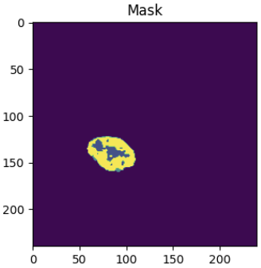

# Brats
# Projet de la segmentation semantiques des tumeurs cérébrales à partir d'images IRM (Imagerie par Résonance Magnétique)

Ce projet est une implémentation d'un système de segmentation sémantique de tumeurs cérébrales utilisant le modèle U-Net. Il est développé en Python.

## Introduction

La reconnaissance de chiffres manuscrits est un problème classique en vision par ordinateur et en apprentissage automatique. Ce projet vise à créer un modèle de machine learning capable de reconnaître des chiffres écrits à la main avec une haute précision.


## Méthode

### Collecte de données
Nous utilisons le célèbre ensemble de données Brats("Brain Tumor Segmentation Challenge")

Ces images IRM sont généralement constituées de plusieurs modalités, telles que :

    T1-weighted (T1) : Cette modalité fournit des images avec un bon contraste entre la matière grise et la matière blanche du cerveau.
    T1-weighted avec contraste (T1c) : Les images T1c sont similaires aux images T1, mais avec l'injection d'un agent de contraste qui permet de mieux visualiser les zones de tumeur.
    T2-weighted (T2) : Cette modalité fournit des images avec un contraste différent qui peut aider à détecter d'autres caractéristiques de la tumeur.
    FLAIR (Fluid Attenuated Inversion Recovery) : Cette modalité supprime le signal de liquide cérébrospinal, ce qui permet de mieux visualiser les zones de tumeur à proximité des cavités remplies de liquide.
### Prétraitement des données
Les images sont normalisées et redimensionnées pour être adaptées à l'entrée du modèle CNN.

### Modèle Unet
description.

## Installation

1. Cloner ce dépôt :

```bash
git clone https://github.com/votre-utilisateur/projet-reconnaissance-chiffres-manuscrits.git
```

2. Installer les dépendances :

```bash
pip install -r requirements.txt
```

3. Lancer le script principal :

```bash
python main.py
```

## Contributions

Les contributions sont les bienvenues ! Si vous souhaitez contribuer à ce projet, veuillez ouvrir une demande d'extraction avec vos modifications.

## Licence

Ce projet est sous licence MIT. Voir le fichier LICENSE pour plus de détails.

---

Pour toute question ou commentaire, veuillez contacter l'auteur du projet à [email@example.com](mailto:email@example.com).
