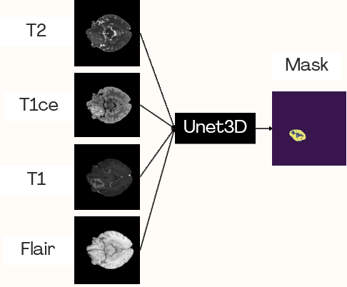
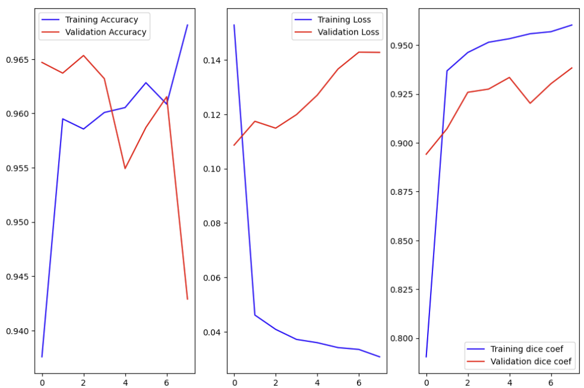
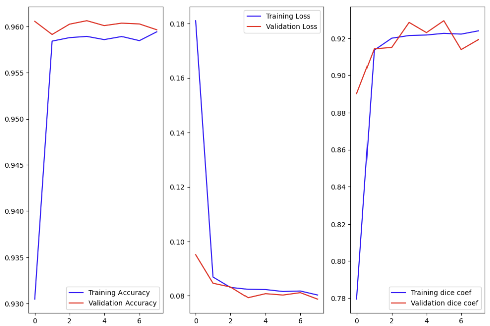

# Brats
# Projet de la segmentation semantiques des tumeurs cérébrales à partir d'images IRM (Imagerie par Résonance Magnétique)

## Résumé


## Introduction

La reconnaissance de chiffres manuscrits est un problème classique en vision par ordinateur et en apprentissage automatique. Ce projet vise à créer un modèle de machine learning capable de reconnaître des chiffres écrits à la main avec une haute précision.


## Méthode

### Collecte de données
Le jeu de données BRATS 2021 contient des IRM multiparamétriques (mpMRI) de gliomes, avec des diagnostics pathologiques confirmés et des informations sur la méthylation du promoteur MGMT. Ces données sont utilisées pour entraîner, valider et tester les modèles dans le défi BRATS de l’anée 2021. Les scans mpMRI comprennent différentes modalités telles que T1, T1-ce, T2 et T2-FLAIR, et ont été annotés manuellement par des experts pour identifier les sous-régions tumorales, telles que la tumeur améliorée par le Gadolinium, le tissu péri-tumoral envahi et le noyau tumoral nécrotique. Les fichiers DICOM associés seront publiés après le défi, et une correspondance entre les données BRATS et d'autres collections facilitera la recherche.


### Prétraitement des données
Les images sont normalisées et redimensionnées pour être adaptées à l'entrée du modèle CNN.

### Modèle Unet
description.
## Architecture de la méthode par fusion précoce des quatre modalités


## Résultats 

 
## Architecture de la méthode par fusion précoce des deux modalités "Flair", "T1_ce"

 

## Résultats 

 
## Installation

1. Cloner ce dépôt :

```bash
git clone https://github.com/votre-utilisateur/projet-reconnaissance-chiffres-manuscrits.git
```

2. Installer les dépendances :

```bash
pip install -r requirements.txt
```

3. Lancer le script principal :

```bash
python main.py
```

## Contributions

Les contributions sont les bienvenues ! Si vous souhaitez contribuer à ce projet, veuillez ouvrir une demande d'extraction avec vos modifications.

## Licence

Ce projet est sous licence MIT. Voir le fichier LICENSE pour plus de détails.

---

Pour toute question ou commentaire, veuillez contacter l'auteur du projet à [email@example.com](mailto:email@example.com).
