# Brats
# Projet de la segmentation semantiques des tumeurs cérébrales à partir d'images IRM (Imagerie par Résonance Magnétique) 

## Résumé
Ce projet se concentre sur la segmentation des tumeurs dans les images IRM cérébrales en utilisant le jeu de données BRATS 2021. La méthode proposée repose sur un modèle U-Net 2D, appliquant la fusion précoce pour intégrer les quatre modalités d'imagerie : T1, T1c, T2 et FLAIR.

Cette approche permet la détection et l'extraction automatiques des sous-régions tumorales, incluant la nécrose, l'œdème et la tumeur active. Nous avons évalué notre modèle sur les ensembles de données d'entraînement et de validation BRATS 2021, totalisant 1250 IRM cérébrales.

Les résultats de cette méthode sont prometteurs, avec des scores Dice de 69,19 % pour la tumeur nécrose, 72,72 pour la tumeur œdème et 80,01 % pour tumeur active sur 10 % de l'ensemble de données de validation. Cette approche offre une segmentation précise et rapide des gliomes, ouvrant la voie à des avancées significatives dans le diagnostic et le traitement des tumeurs cérébrales.

## Introduction

L'imagerie par résonance magnétique (IRM) est un outil crucial pour le diagnostic des tumeurs cérébrales. Cependant, la segmentation manuelle des tumeurs dans les images IRM est une tâche très complexe. D'où l'intérêt de l'automatisation de la segmentation des tumeurs cérébrales. Nous proposons donc une méthode basée sur un modèle U-Net 2D.

## Méthode

### Dataset && Paramètres
Le jeu de données BRATS 2021 contient des IRM multiparamétriques (mpMRI) de gliomes, avec des diagnostics pathologiques confirmés et des informations sur la méthylation du promoteur MGMT qui sont utilisées pour entraîner, valider et tester les modèles dans le défi BRATS de l’anée 2021. Les scans mpMRI comprennent différentes modalités telles que T1, T1-ce, T2 et T2-FLAIR, et ont été annotés manuellement par des experts pour identifier les sous-régions tumorales, telles que la tumeur améliorée par le Gadolinium, le tissu péri-tumoral envahi et le noyau tumoral nécrotique. Le jeu de données dans cette étude est composé de 1251 images : 1012 pour l'entraînement, 126 pour la validation, et 113 pour le test.
Pendant l'entraînement, nous utilisons un learning_rate   de 0.001 sur 15 époques, avec des images de taille 128x128. Les métriques évaluées comprennent MeanIoU (pour quatre classes), dice_coef, précision, sensibilité, spécificité, et à nouveau dice_coef pour assurer une évaluation globale complète.

## Modèle U-Net
U-Net est une architecture pour la segmentation sémantique. Il se compose d'un chemin de contraction et d'un chemin d'expansion. Le chemin de contraction suit l'architecture typique d'un réseau convolutionnel. Il consiste en l'application répétée de deux convolutions 3x3 (convolutions sans remplissage), chacune suivie d'une unité linéaire rectifiée (ReLU) et d'une opération de pooling max 2x2 avec stride 2 pour le sous-échantillonnage.

 

### Architecture de la méthode par fusion précoce des quatre modalités


### Résultats 

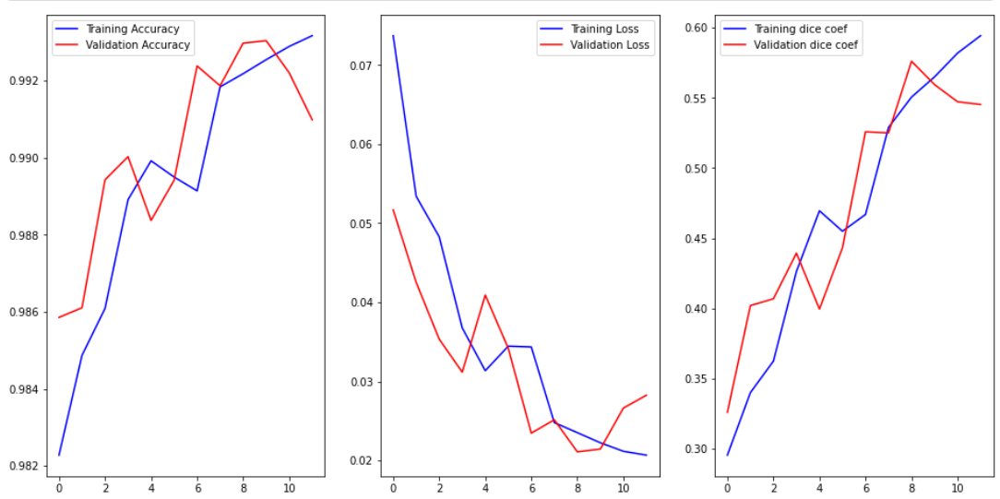

À l'époque 11 sur 15, les résultats sur l'ensemble de test montrent une performance globale élevée du modèle. La métrique Mean IoU (Intersection over Union) est de 0.3931, indiquant une bonne précision dans la délimitation des régions de tumeurs. Le dice coefficient, qui mesure la similarité entre les prédictions et les vérités terrain, est également élevé à 0.6123, indiquant une correspondance étroite entre les prédictions et les annotations. Les valeurs de précision, sensibilité et spécificité sont également élevées, démontrant la capacité du modèle à bien classifier les différents types de tumeurs. En ce qui concerne les sous-régions tumorales, les coefficients de Dice pour la nécrose, l'œdème et la tumeur active sont respectivement de 0.5846, 0.6964 et 0.7215, avec des valeurs plus élevées pour l'œdème et la tumeur active, ce qui suggère une segmentation précise de ces régions.

Les résultats sur l'ensemble de validation montrent une performance impressionnante du modèle. La métrique Mean IoU (Intersection over Union) est de 0.3937, indiquant une précision considérable dans la délimitation des régions de tumeurs. Le dice coefficient, mesurant la similarité entre les prédictions et les annotations, est également élevé à 0.6395, soulignant une forte corrélation entre les deux. Les valeurs de précision, sensibilité et spécificité sont également élevées, démontrant la capacité du modèle à classifier avec précision les différentes classes de tumeurs. Pour les sous-régions tumorales, les coefficients de Dice pour la nécrose, l'œdème et la tumeur active sont respectivement de 0.6100, 0.7601 et 0.7692, confirmant une segmentation précise de ces régions.

Des examples

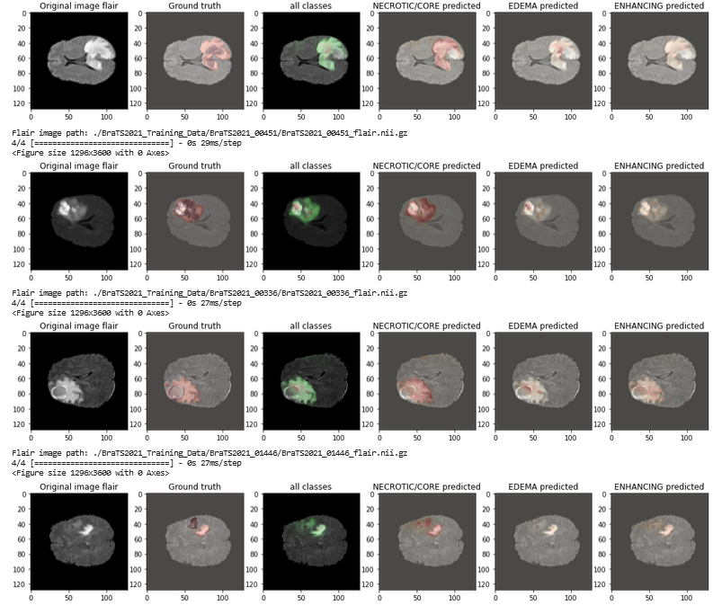

 
### Architecture de la méthode par fusion précoce des quatre modalités moyenne

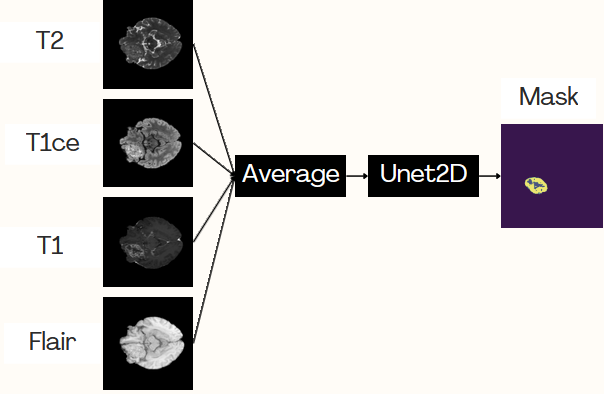

### Résultats 

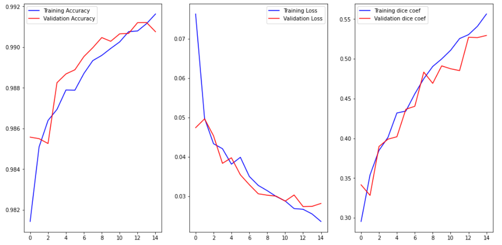
 
Les résultats sur l'ensemble de validation montrent une performance remarquable du modèle. La métrique Mean IoU (Intersection over Union) est élevée à 0.8266, indiquant une précision significative dans la délimitation des régions de tumeurs. Le dice coefficient, qui mesure la similarité entre les prédictions et les annotations, est également satisfaisant à 0.5295, soulignant une corrélation raisonnable entre les deux. Les valeurs de précision et de sensibilité sont élevées, respectivement à 0.9913 et 0.9894, démontrant la capacité du modèle à classifier avec précision les différentes classes de tumeurs. La spécificité est également élevée, à 0.9971, ce qui confirme la capacité du modèle à identifier les vrais négatifs. En ce qui concerne les sous-régions tumorales, les coefficients de Dice pour la nécrose, l'œdème et la tumeur active sont respectivement de 0.4911, 0.5695 et 0.6145, indiquant une segmentation raisonnablement précise de ces régions.

Les résultats sur l'ensemble de test montrent une performance remarquable du modèle. La métrique Mean IoU (Intersection over Union) est élevée à 0.7700, indiquant une précision significative dans la délimitation des régions de tumeurs. Le dice coefficient, qui mesure la similarité entre les prédictions et les annotations, est également satisfaisant à 0.5371, soulignant une corrélation raisonnable entre les deux. Les valeurs de précision et de sensibilité sont élevées, respectivement à 0.9905 et 0.9884, démontrant la capacité du modèle à classifier avec précision les différentes classes de tumeurs. La spécificité est également élevée, à 0.9968, ce qui confirme la capacité du modèle à identifier les vrais négatifs. En ce qui concerne les sous-régions tumorales, les coefficients de Dice pour la nécrose, l'œdème et la tumeur active sont respectivement de 0.4801, 0.5767 et 0.6342, indiquant une segmentation raisonnablement précise de ces régions.

Des examples

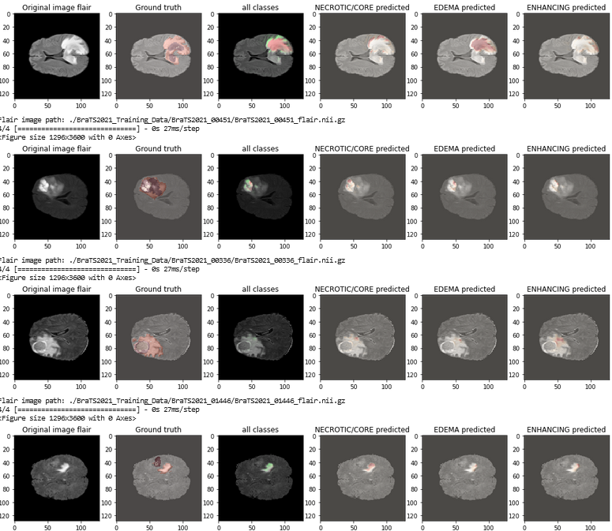

example tranches 

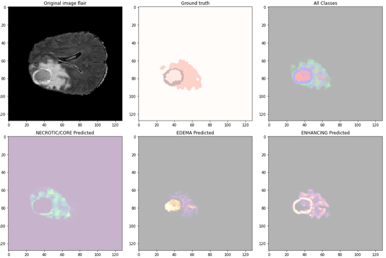

example tranches 

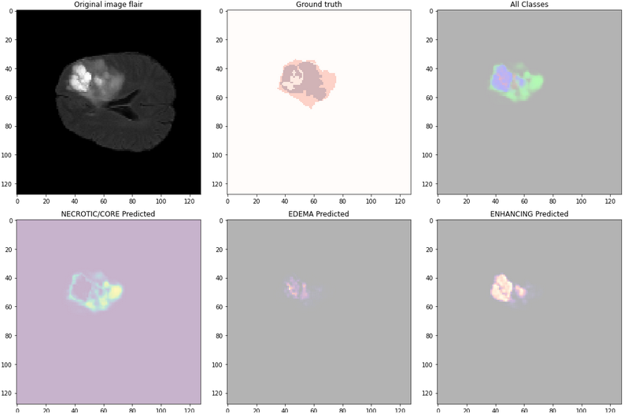


### Architecture de la méthode par fusion précoce des 2 modalités 


### Résultats 

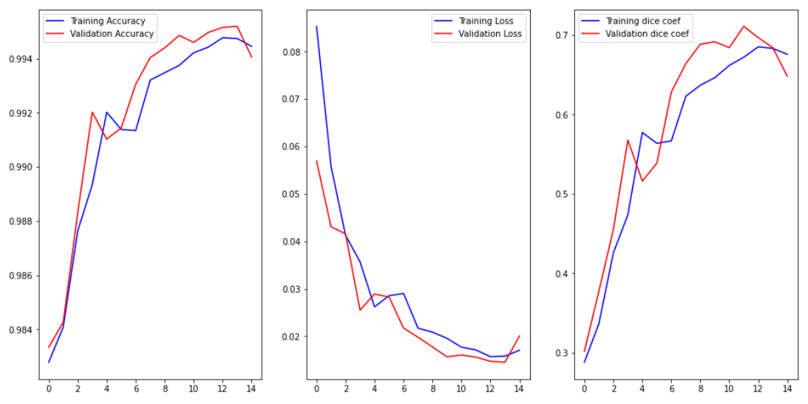
 
Les résultats sur l'ensemble de validation montrent une performance remarquable du modèle. La métrique Mean IoU (Intersection over Union) est élevée à 0.8351, indiquant une précision significative dans la délimitation des régions de tumeurs. Le dice coefficient, qui mesure la similarité entre les prédictions et les annotations, est également satisfaisant à 0.6482, soulignant une corrélation raisonnable entre les deux. Les valeurs de précision et de sensibilité sont élevées, respectivement à 0.9942 et 0.9927, démontrant la capacité du modèle à classifier avec précision les différentes classes de tumeurs. La spécificité est également élevée, à 0.9980, ce qui confirme la capacité du modèle à identifier les vrais négatifs. En ce qui concerne les sous-régions tumorales, les coefficients de Dice pour la nécrose, l'œdème et la tumeur active sont respectivement de 0.6919, 0.7272 et 0.8001, indiquant une segmentation raisonnablement précise de ces régions.
Les résultats sur l'ensemble de test montrent une performance remarquable du modèle. La métrique Mean IoU (Intersection over Union) est élevée à 0.8360, indiquant une précision significative dans la délimitation des régions de tumeurs. Le dice coefficient, qui mesure la similarité entre les prédictions et les annotations, est également satisfaisant à 0.6325, soulignant une corrélation raisonnable entre les deux. Les valeurs de précision et de sensibilité sont élevées, respectivement à 0.9935 et 0.9922, démontrant la capacité du modèle à classifier avec précision les différentes classes de tumeurs. La spécificité est également élevée, à 0.9978, ce qui confirme la capacité du modèle à identifier les vrais négatifs. En ce qui concerne les sous-régions tumorales, les coefficients de Dice pour la nécrose, l'œdème et la tumeur active sont respectivement de 0.6511, 0.7150 et 0.7619, indiquant une segmentation raisonnablement précise de ces régions.

Des examples

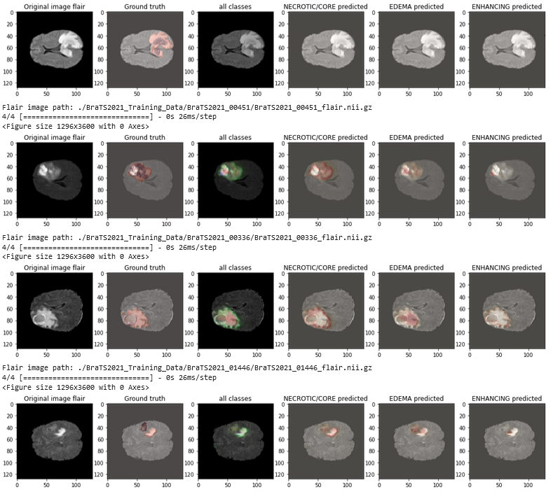

example tranches 

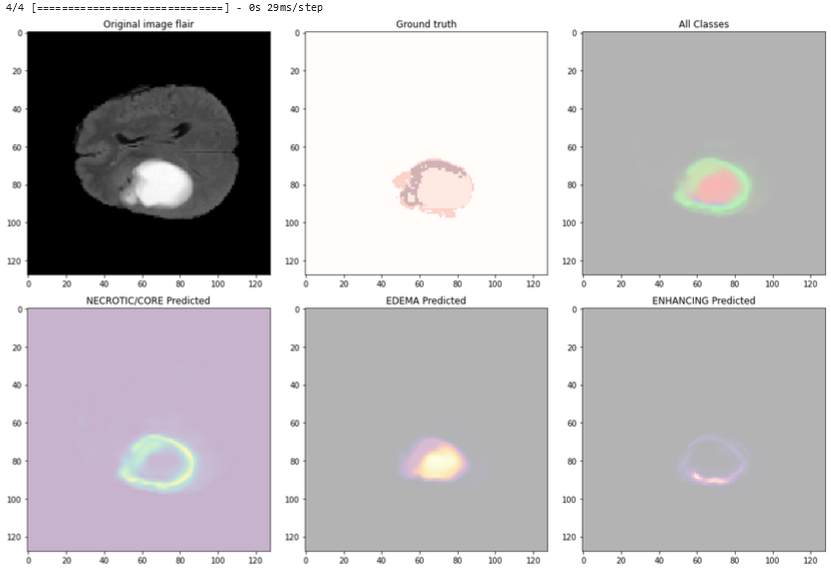

example tranches 

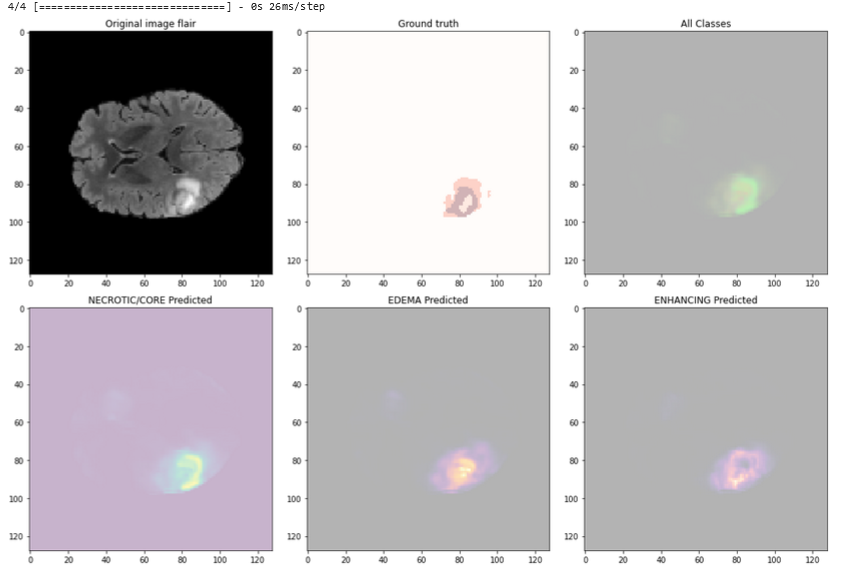
## Installation

1. Cloner ce dépôt :

```bash
git clone https://github.com/votre-utilisateur/projet-reconnaissance-chiffres-manuscrits.git
```

2. Installer les dépendances :

```bash
pip install -r requirements.txt
```

3. Lancer le script principal :

```bash
python main.py
```

## Contributions

Les contributions sont les bienvenues ! Si vous souhaitez contribuer à ce projet, veuillez ouvrir une demande d'extraction avec vos modifications.

## Licence

Ce projet est sous licence MIT. Voir le fichier LICENSE pour plus de détails.

---

Pour toute question ou commentaire, veuillez contacter l'auteur du projet à [email@example.com](mailto:email@example.com).
