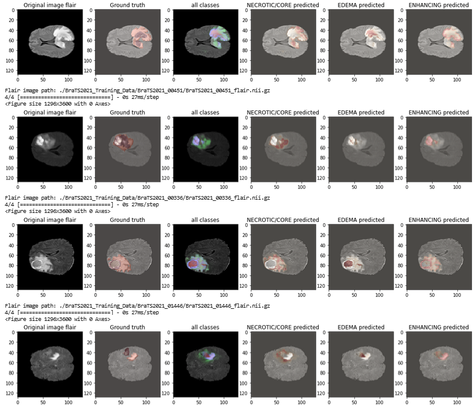

# Brats
# Projet de la segmentation semantiques des tumeurs cérébrales à partir d'images IRM (Imagerie par Résonance Magnétique)

## Résumé
Ce projet se concentre sur la segmentation des tumeurs dans les images IRM cérébrales en utilisant le jeu de données BRATS 2021. La méthode proposée repose sur un modèle U-Net 2D, appliquant la fusion précoce pour intégrer les quatre modalités d'imagerie : T1, T1c, T2 et FLAIR.

Cette approche permet la détection et l'extraction automatiques des sous-régions tumorales, incluant la nécrose, l'œdème et la tumeur active. Nous avons évalué notre modèle sur les ensembles de données d'entraînement et de validation BRATS 2021, totalisant 1250 IRM cérébrales.

Les résultats de cette méthode sont prometteurs, avec des scores Dice de ******** pour la tumeur en croissance (ET), **** pour la tumeur complète (WT) et **** pour le noyau tumoral (TC) sur 20 % de l'ensemble de données d'entraînement. Cette approche offre une segmentation précise et rapide des gliomes, ouvrant la voie à des avancées significatives dans le diagnostic et le traitement des tumeurs cérébrales.

## Introduction

L'imagerie par résonance magnétique (IRM) est un outil crucial pour le diagnostic des tumeurs cérébrales. Cependant, la segmentation manuelle des tumeurs dans les images IRM est une tâche très complexe. D'où l'intérêt de l'automatisation de la segmentation des tumeurs cérébrales. Nous proposons donc une méthode basée sur un modèle U-Net 2D.

## Méthode

### Dataset
Le jeu de données BRATS 2021 contient des IRM multiparamétriques (mpMRI) de gliomes, avec des diagnostics pathologiques confirmés et des informations sur la méthylation du promoteur MGMT qui sont utilisées pour entraîner, valider et tester les modèles dans le défi BRATS de l’anée 2021. Les scans mpMRI comprennent différentes modalités telles que T1, T1-ce, T2 et T2-FLAIR, et ont été annotés manuellement par des experts pour identifier les sous-régions tumorales, telles que la tumeur améliorée par le Gadolinium, le tissu péri-tumoral envahi et le noyau tumoral nécrotique. Le jeu de données dans cette étude est composé de 1251 images : 1012 pour l'entraînement, 126 pour la validation, et 113 pour le test.

## Modèle U-Net
U-Net est une architecture pour la segmentation sémantique. Il se compose d'un chemin de contraction et d'un chemin d'expansion. Le chemin de contraction suit l'architecture typique d'un réseau convolutionnel. Il consiste en l'application répétée de deux convolutions 3x3 (convolutions sans remplissage), chacune suivie d'une unité linéaire rectifiée (ReLU) et d'une opération de pooling max 2x2 avec stride 2 pour le sous-échantillonnage.

Traduit avec DeepL.com (version gratuite)
 

### Architecture de la méthode par fusion précoce des quatre modalités


### Résultats 


### Architecture de la méthode par fusion précoce des quatre modalités avec le calcul de leurs moyenne

 

### Résultats 


Des examples



Un example


Un example


## Installation

1. Cloner ce dépôt :

```bash
git clone https://github.com/votre-utilisateur/projet-reconnaissance-chiffres-manuscrits.git
```

2. Installer les dépendances :

```bash
pip install -r requirements.txt
```

3. Lancer le script principal :

```bash
python main.py
```

## Contributions

Les contributions sont les bienvenues ! Si vous souhaitez contribuer à ce projet, veuillez ouvrir une demande d'extraction avec vos modifications.

## Licence

Ce projet est sous licence MIT. Voir le fichier LICENSE pour plus de détails.

---

Pour toute question ou commentaire, veuillez contacter l'auteur du projet à [email@example.com](mailto:email@example.com).
